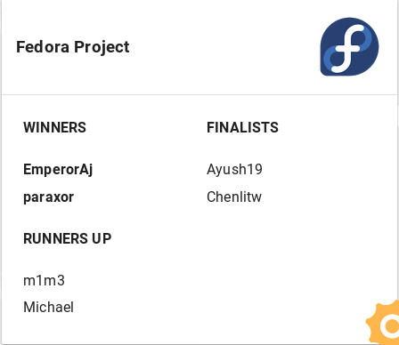

# Google Code In 2019 #

This year I (Display Name: `m1m3`) completed 66 tasks and was named a Runner UP by [Fedora Project.](https://getfedora.org/)

## Task 1: Install Dash to dock extension gnome ##

### Task Description: ### 
Dash to dock is a gnome extension that provides variety of options to customise your dash panel the way you desire.
Install this Extension and apply your desired settings, you can follow the guide in Github

## Task 2: Install VIM, install plugins and set keybinds ##

### Task Description: ##
Vim is the modern version of vi text editor. It was designed in the days when there was no mouse hence it is a keyboard-centric editor with full mouse support. It is really comfortable as the user doesn’t need to use the mouse frequently. You install vim on your machine using dnf, install vim plugins you like and found on internet, customize vim and edit a file in vim. The intended output is a screen recording of editing a file with Vim. You are free to use any screen recorder make sure you installed some plugins and show the vimrc file.

#### NOTE: Since these two were beginner tasks, I am not including solutions for it. ####

## Task 3: Write an Article about hardware Acceleration ##

### Task Description: ###
What is Hardware acceleration and when do we use it? How can we implement it in an application? what benefits does it carry?...
Submit a blog post about hardware acceleration, benefits, uses, etc and submit it before the end of the deadline.

### Submission: ###
- Blog Link - https://hardwareacc.blogspot.com/2019/12/hardware-acceleration-introduction-in_4.html?m=1

## Task 4: Brute Forcing password protected zip files ##

### Task Description: ###
A brute force attack is a trial and error method used by application programs to Crack encrypted data like passwords by trying many possible combinations. You need to create an application using python/shell that can crack open a password protected zip folder. You need to:

1. Create a zip file and encrypt it by giving a password.
2. Create a wordlist(Make sure your password is in the wordlist, if you actually start brute forcing a zip files using a big wordlist it might take a long time).
3. Run your script against the zip file you encrypted.

Deliverables:

You have to submit:

- The code for your own brute force tool
- The zip file you cracked, and
- The Asciinema

### Submission: ###
- Github Link - https://github.com/madhavmehndiratta/Google-Code-In-2019/tree/master/zip-bruteforce

## Task 5: File forensics using bash tools ##

### Task Description: ###
This file has been infused with a hidden flag, using basic linux tools. You might have to install a package or two. find the git repository, download the image file, and look for the flag. if you're stuck for too long you may ask for a hint.
- https://github.com/iamzubin/gci-ctf 

### Submission: ###
- Screenshot - [resources/task5.png](resources/task5.png) 

## Task 6: Create a script to know who is on your Wi-Fi ##

### Task Description: ###
WiFi Reconnaissance is an important process in information gathering. You can know the number of people connected to your WiFi and get their MAC(Media Access Control) which will help you further in exploiting the device. You need to create a WiFi Recon tool that scans the whole network and finds all the devices connected to it.

Deliverables:

- Share the code in Pagure/Github and attach the Asciinema showing the number of devices to the Wifi.

### Submission: ###
- Github Link - https://github.com/madhavmehndiratta/Google-Code-In-2019/tree/master/network-scanner

## Task 7: Install VSCodium with repo ##

### Task Description: ###
Managing repositories is very important in Linux, it can effect your download speed and the security of the installed application.
VSCodium is not available in most of the included in default repositories so you have to create a new repository with the given file, and provide a PGP key to get access. This way you get updates as fast as possible and ensure the safety of your software. The guide link is included here. This guide is specialised for Fedora and RHEL based distributions, you should find documentation of your installed Linux distributions by yourself, being able to use your documents to your advantage is an important factor in Linux and OpenSource aimed software.
https://drubles.blogspot.com/2019/04/how-to-install-vscodium-in-linux.html 

### Submission: ###
- Screenshot - [resources/task7.png](resources/task7.png)

## Task 8: Package a python application in RPM ##

### Task Description: ###
The easiest way to publish an application for a linux distribution is by making a package of that application, You have to write a simple application using python (It can be a hello world application), and build an rpm package for the same.

Submit the SRPM file, Spec file and a small step by step guide (~150 words).
- https://docs.python.org/2.0/dist/creating-rpms.html 

### Submission: ###
- Github Link - https://github.com/madhavmehndiratta/Google-Code-In-2019/tree/master/rpm-package

## Task 9: Reverse Engineering to extract password from binary files ##

### Task Description: ###
Reverse Engineering means when you duplicate a specific software back to its construction. It has many applications in the field of cyber-security. I am going to provide some binary files each hidden with a password to crack. You need to reverse the binary and try getting the password.

I will be providing you with 3 files from which you need to extract the password out of the Memory.

HINT: The string that you think is a hex might not be a hex

Deliverables:

Share the Screenshots in a PDF/Word file showing the steps(it will be great if you can explain what you understand from the reversed binary) you took to crack the password. Please attach an ASCIINEMA showing you entering the password to crack.

### Submission: ###
Asciinema - https://asciinema.org/a/am4T1rcdcLueDmjYv5aUR4JXV

## Task 10: Hide text inside an image using Stegnography. ##

### Task Description: ###
Stenography is the practice of concealing a file, message, image, or video within another file, message, image, or video. It is related to cryptography and is just about as old. You can use it to transport sensitive data from point A to point B such that the transfer of the data is unknown. This helps data to conserve its integrity. You need to create a Script that encodes and decodes a text from an image(png and jpg). I have attached a link showing how your output should look like.

Deliverables:

Submit the code in Pagure/GitHub. Attach the image you encrypted along with the Asciinema recording while you perform the encryption and decryption.

### Submission: ###
- Github Repo - https://github.com/madhavmehndiratta/Google-Code-In-2019/tree/master/image-steganography

- Asciinema - https://asciinema.org/a/e2bQzgczJ5VH6aAR2MLSyhpc1

## Task 11: Detect the XSS Vulnerability ##

### Task Description: ###
XSS(Cross-Site Scripting) is a security vulnerability found in a web application that allows an attacker to inject client-side script(Ex. JavaScript) to a webpage through input areas like a search box, forms, file upload and execute it at user’s end without authorization. The severity of cross site scripting attack can range from showing the useless alert box to stealing cookies, user’s session ids & take over the account. You need to perform 4 XSS attacks as follows:

1. Create an alert box saying "HACKED".
2. Change the background color of the website to "RED" .
3. Change the background of the website to an image of your choice.
4. Redirect the website to another page saying "You Are Hacked"(You can use HTMLPASTA to create your own page and redirect it to 5. the vulnerable web app).

Keep your attack limited to the website provided to you. Please do not perform any type of XSS attack in someone else's website.

Deliverables:

Share the Screenshots of all 4 attacks in a PDF/Word file. Below the screenshots write the code snippet that you used to execute the preceding.

### Submission: ###
- File - [resources/task11.docx](resources/task11.docx) 

## Task 12: Generate SSH keys and set them up on FAS ##

### Task Description: ###
Steps to follow:

1. Create a SSH key (if you don't already have one)
2. Create a FAS ID on Fedora Account System
3. Add your SSH key in FAS account and submit the task to be verified with your FAS ID.

Follow the guidelines here to generate SSH keys and add them to your FAS account.

### Submission: ###
- Generated the keys and submitted it to the mentor.

## Task 13: Generate SSH keys and set them up Pagure ##

### Task Description: ###
Steps to follow:

1. Create a SSH key (if you don't already have one).
2. Create a Pagure account here.
3. Add your SSH key in Pagure account.
4. Please submit an asciinema of you pushing a commit to a pagure repository.

Follow this guide to help set SSH keys on Pagure.

### Submission: ###
- Generated the keys and submitted it to the mentor.

## Task 14: Craft your custom port scanner in python. ##

### Task Description: ###
A port scanner is a tool for determining which ports are open on a network. Ports are used to send and receive information. Ports vary in their services offered. They are numbered from 0 to 65535, but certain ranges are more frequently used(For example 22 for SSH, 80 for HTTP). Craft a custom port scanner in python and run it on your network only.

Deliverables:

Share the code in Pagure/GitHub and also attach the Asciinema recording of the scanner running in your terminal. 

### Submission: ###
- Github Repo - https://github.com/madhavmehndiratta/Google-Code-In-2019/tree/master/port-scanner
- Asciinema - https://asciinema.org/a/Sk6Yd2gXWwxjHkgPffdzdwxBb

## Task 15: Setup minishift on your local machine ##

### Task Description: ###
Resources https://docs.okd.io/latest/minishift/getting-started/index.html

Minishift is a tool that helps you run OKD locally by launching a single-node OKD cluster inside a virtual machine. Install it on your local machines and share the screenshot of terminal and browser running the same

### Submission: ###
- Submitted the relevant screenshot to the mentor.

## Task 16: OSINT - Open Source Intelligence on Public Platform ##

### Task Description: ###
Open-source intelligence is data collected from publicly available sources. The information comes from a variety of sources, including the social media pages, Personal Blogs, Websites, etc. These can be a humongous source of information, such as social media life, and information about the victims acquaintances. OSINT has been used by hackers for the Information Gathering process. You need to create a Python/shell script that checks out the presence of an individual in 3 different website. I have provided the link on how it should look like when a user is present in the specific website.

Deliverables:

Upload your script to GitHub/Pagure and attach a Asciinema of your terminal showing the script doing its job. 

### Submission: ###
- Github Repo - https://github.com/madhavmehndiratta/Google-Code-In-2019/tree/master/social-media-scanner
- Asciinema - https://asciinema.org/a/0LRN6EgjxLqP5TuQf6K9B18Yd

## Task 17: Learn basics of GPG ##

### Task Description: ###

1. Create a gpg key if you don't already have one
2. Import my gpg.pub from vipul.dev/gpg.txt
3. Encrypt a paragraph on GPG key and RSA algorithm using my public key and put the file in comment section here.

There are thousands of online tutorials, you should be able to do this without any human interaction :)

### Submission: ###
- Created the key and submitted to the mentor.

## Task 18: Exploiting a Directory Listing vulnerability in a web server. ##

### Task Description: ###
Directory listing is a web server vulnerability that shows a list of all the files and folders present in the server in case an index file, such as index.php, index.html, or default.asp is not present. This might expose critical information to anyone who finds the location. A website spider(Web Crawler) crawls in the website to find all the directory that was mentioned in the index page. Create a website crawler using python that finds out all the directories present in the index page. Run it against any website to find the directories.

Deliverables:

Share the code in Pagure/GitHub and attach the Asciinema. Write how can we prevent this attack in the README.md file.

### Submission: ###
- Github Repo - https://github.com/madhavmehndiratta/Google-Code-In-2019/tree/master/web-crawler
- Asciinema - https://asciinema.org/a/TeQ225uxTGU3DbJmDtKnOvpNd

## Task 19: Setup Borg backup ##

### Task Description: ###
Ever tired of losing your data? is a deduplicating backup program. Optionally, it supports compression and authenticated encryption.
The main goal of Borg is to provide an efficient and secure way to backup data. The data deduplication technique used makes Borg suitable for daily backups since only changes are stored. Install BorgBackup and take a backup of your file.
Submit the screenshot of borg using "systemctl status" command, screenshot of the backed up files and borg reports.
- https://borgbackup.readthedocs.io/en/stable/quickstart.html 

### Submission: ###
- Pdf - [resources/task19.pdf](resources/task19.pdf)

## Task 20: Create your own custom Word-list Generator ##

### Task Description: ###
As you Know that when you perform a Brute-Force attack you need to have wordlist that has multiple passwords. Most of the wordlist available in the internet is made up of random possible passwords. But think of a situation where you need to exploit a person whose password is related to his pet's name like Schmuserkadser(Famous meme of the crying cat). In that situation, there is a very less chance that you are gonna find a wordlist containing the specific pet's name. You need to create a wordlist generator which will take user inputs and use the inputs for creating possible password combination. Your script should at least take 6 to 7 inputs before it starts creating passwords.

optional: Include 1337 mode in your script which will change characters like Hello -> h3ll0

Deliverables:

Share the code in GitHub/Pagure with the ASCIINEMA included. 

### Submission: ###
- Github Repo - https://github.com/madhavmehndiratta/Google-Code-In-2019/tree/master/wordlist-generator
- Asciinema - https://asciinema.org/a/SRHTj18qphstPUlsLqSqleuQ5

## Task 21: Hashing and Hash Cracking ##

### Task Description: ###
Hash functions are used all over the internet in order to securely store passwords, find duplicate records, quickly store and retrieve data, and more. No matter the input, the output of a hash function always has the same size. Encryption can be decrypted but, hashing can not be DE-Hashed(There is no such thing as dehashing). As we can't De-hash string we need to crack them. In this task you need to create a script that does both hashing and cracking. It should support the following Hash Functions:

md5, sha1, sha224, sha256, sha384, sha512

I have attached a link showing how it should work. If you want you can add cool features like online cracking, etc.
https://asciinema.org/a/KVbR61oyXMxVqVNNLF88EMYbu

Deliverables:

Share the GitHub/Pagure link which has your code and the link to the ASCIINEMA. 

### Submission: ###
- Github Repo - https://github.com/madhavmehndiratta/Google-Code-In-2019/tree/master/hashing-and-cracking
- Asciinema - https://asciinema.org/a/pWs3dBXzP3OktVzqrC3QjepU4

## Task 22: Automated codeforces registration ##

### Task Description: ###
Automated Registration for contests at Codeforces Platform Using Selenium.Your task involves installing Selenium web driver on Firefox/Chrome, using python to write a script to open your preferred browser, open Codeforces and register to the contest. And once its done, take a screenshot of the window. Make a github repo with your script and a readme clearly stating the steps of using the script.

### Submission: ###
- GitHub Repo - https://github.com/madhavmehndiratta/Google-Code-In-2019/tree/master/codeforces-autoregistration

## Task 23: Run an application in podman container ##

### Task Description: ###
Podman is a daemonless container engine for developing, managing, and running OCI Containers on your Linux System, This helps the application you’re developing to be unaffected with the system you’re running it on. In this task you’ll have to clone a given git repository and make the application run in a podman container. The steps are in the readme file of repository.

Submit screenshot/recorded video of the steps
https://github.com/iamzubin/podman-example 

### Submission: ###
- Screenshot - [resources/task23.png](resources/task23.png)

## Task 24: Make a GUI in Python to automate 3 most done tasks ##

### Task Description: ###
Make a GUI application in Python using Tkinter which gets launched when your system starts. Automating 3 tasks incorporate something like (sample) Opening your Github account in a browser. Show your Twitter feed. Play your favourite music playlist.

In order to complete the part, where the GUI is launched on system boot, write the steps you followed in ".txt" file.

### Submission: ###
Github Repo - https://github.com/madhavmehndiratta/Google-Code-In-2019/tree/master/lazyscript/

## Task 25: Create your own Shodan scanner for your terminal ##

### Task Description: ###
Shodan is a search engine that lets user find specific devices connected to the internet using various filters. It works by searching the entire internet and returning various devices such as lists of routers, Webcam, surveillance cameras. In the Security of the internet of things, shodan can also be used to pin point the location of devices connected to the internet. You need to create a script for your terminal that has 3 options as follows:

- Get your IP
- Shodan Search to scan IPs, Hostnames, ports
- Scanning a specific Host

I have attached a link showing how the output of your program should look like. If you find an IP with an open port, please do not try gaining access to the device.

Deliverables:

Share the Screenshots of all 3 attacks in a PDF/Word file. Below the screenshots write the code snippet that you used to execute the preceding. Attach the link to the Gihub/Pagure repo and attach an ASCIINEMA recording of your terminal.

### Submission: ###
- GitHub Repo - https://github.com/madhavmehndiratta/shodan-scanner
- Asciinema - https://asciinema.org/a/6z3qC4Sm3dH6O6rkvwVrgJm61

## Task 26: Hello World application in Django ##

### Task Description: ###
Install python3 and Django 2.x on your linux workstation and get started with your first django application. Firstly install the requirements and then initialize your first application and use it on the localhost. Explore the use of models, views and urls as they would be used in other django related tasks.Also,create a superuser and explore the admin panel. Finally create a repository with readme.md file and the code for the first Hello world app. The readme must contain the instructions to set up django and also to get your hello world app running.

### Submission: ###
- Github Repo - https://github.com/madhavmehndiratta/Google-Code-In-2019/tree/master/django-helloworld

## Task 27: Spell checker with python ##

### Task Description: ###
Ever felt how spell checking works? it instantly detects the errors and prompts you to fix them, based on the same idea. The program you create should:

1. include 20 words to spell check.
2. when given a paragraph it can detect the spelling error of the given 20 words.
3. it should output the fixed or "correctly" spelled paragraph.
4. Please note that the paragraph will include many words but the program should ignore and only fix the words that are given to it.
5. Submit the code in .py format.
6. You are allowed to use the spellchecker pip package.

### Submission: ###
- GitHub Repo - https://github.com/madhavmehndiratta/Google-Code-In-2019/tree/master/spell-check

## Task 28: Code an app that shows the state of 2 circles ##

### Task Description: ###
In Geometry you might've studied about the state of two lines, two circles, either they intersect, or don't or have 2 points of intersection. Create a program that when given the radius of 2 circles and their distance with each other it draws them and prints their states compared to each other. You can see how the input and output should look like in here
The app must be able to tell:

- If the circles are concentric
- If they are tangent (One point of intersection)
- If they have two points of intersection.
- If they have no point of intersection.
- You should submit your source code only. You can check the link given for python, note that other methods of solving this task is welcomed!
- Hint: you can use python turtle for drawings.

### Submission: ###
- GitHub Repo - https://github.com/madhavmehndiratta/Google-Code-In-2019/tree/master/circles-state

## Task 29: Test the Fedora Kernel ##

### Task Description: ###
You need to have Fedora running on a physical system for this task

Install the latest fedora kernel from updates-testing and rawhide using these commands:

dnf install kernel --enablerepo=updates-testing

Run the kernel test suide as described at https://fedoraproject.org/wiki/QA:Testcase_kernel_regression

Configure your fas ID before running the test suite to make sure your results are uploaded to our bug tracker.

Report success & failure with your full hardware info. Append output of lshw --sanitize and the test suite

### Submission: ###
- Submit the test report to the mentor. 

## Task 30: Create an Ansibile Role to automate the installation process of tensorflow. ##

### Task Description: ###
Ansible uses YAML(YAML Ain’t Markup Language) syntax. Unlike many programming languages, YAML is relatively easy to understand by just looking at the code. Ansible playbooks are cool tools widely used in automation of tasks that takes up time. Tensorflow is an open-source library with is capable of running machine learning algorithms. It was developed by google brain’s team. The installation processes can sometimes be tiresome. Learn more about Tensorflow and Create an Ansible Role to automate the installation process of Tensorflow(CLI-Command Line Interface) or GUI(Graphic User Interface).

Deliverables:

Upload the Code to Pagure/GitHub and give a small explanation about Tensorflow in the README file. Provide an Asciinema of your terminal while executing your code.

### Submission: ###
- GitHub Repo - https://github.com/madhavmehndiratta/Google-Code-In-2019/tree/master/ansible-playbook-tensorflow
- Asciinema - https://asciinema.org/a/h5LpWpXlP6wZH2m9liBDELqzK

## Task 31: Copy python tests for Modulemd.ModuleIndexMerger.test_merger_with_real_world_data into C ##

### Task Description: ###
Currently, most of the tests for the merger are run under Python. The valgrind tests for identifying memory leaks and errors can only run against tests in the C code. We need to replicate the python tests as C tests. This will ensure that these code-paths are scanned with valgrind for leaks when ninja test is run (and when the CI test suite is executed). Look at the tests being run in https://github.com/fedora-modularity/libmodulemd/blob/master/modulemd/tests/ModulemdTests/merger.py#L191 and copy them into https://github.com/fedora-modularity/libmodulemd/blob/master/modulemd/tests/test-modulemd-merger.c
https://github.com/fedora-modularity/libmodulemd#getting-started-with-developing

### Submission: ###
- Pull Request - https://github.com/fedora-modularity/libmodulemd/pull/412

## Task 32: Tic Tac Toe GUI ##

### Task Description: ###
Make a GUI to implement Tic Tac Toe game using Tkinter. Convert the GUi to a .deb file for use on your favourite linux distribution. Make a github repository with the code and instructions to use it.

### Submission: ###
Github Repo - https://github.com/madhavmehndiratta/Google-Code-In-2019/tree/master/tic-tac-toe

## Task 33: Use python-fedora to find out the FAS ID corresponding to an email ID ##

### Task Description: ###
Given a FAS ID as input, provide the corresponding email for using python-fedora (https://github.com/fedora-infra/python-fedora)

Task Details Install python-fedora using pip. Create a script that asks the user to enter a username and prints the email associated with that user account.

Resources You can make use of the following resources to complete the task:

- Official GitHub repository for python-fedora

Deliverables Please upload the script and submit a link to the repository (hosted either on GitHub or Pagure).

### Submission: ###
- Github Repo - https://github.com/madhavmehndiratta/Google-Code-In-2019/tree/master/fas-associated-email

## Task 34: Setup fedora-messaging on your local machine and publish & listen messgaes ##

### Task Description: ###
Task Details Setup Fedora Messaging on your local machine and create a sample publisher and listener to test the installation.

Resources You can make use of the following resources to complete the task: Follow the official documentation of Fedora Messaging here.

Deliverables

- Please submit a GitHub link to the repository containing the script for the publisher build.
- Upload a screenshot or screen recording of the listener and publisher in action.

### Submission: ###
- Github Repo - https://github.com/madhavmehndiratta/Google-Code-In-2019/tree/master/fedora-messaging

## Task 35: Write a blogpost about how to setup fedora messaging to listen and publish messages using message schemas ##

### Task Description: ###
Task Details Document how you completed the previous task. Create a draft on Fedora's [community blog(https://communityblog.fedoraproject.org/)]. You can also host it on your personal blog, if you have one.

Deliverables Please submit a link to draft post made on Fedora Community Blog or the link to your blog.

### Submission: ###
- Blog - https://fedora-messaging-tutorial.blogspot.com/2019/12/introduction-to-fedora-messaging.html

## Task 36: Create an Ansible Module that gets the HTTP Response Status Code from a website ##

### Task Description: ###
Modules are bits of code sent to the system and executed to fulfill the task. HTTP Status Codes are 3 digit numbers generated by a server when a request is made. There are 5 values for the first digit, those numbers differentiate between the codes. You need to create an Ansible module to get the Response status from a website. I have attached the Asciinema of how the output should look like.

Deliverables:

Upload the Code to Pagure/GitHub and give a small explanation about response codes in the README file. Provide an Asciinema of your terminal while executing your code.

### Submission: ###
- Github Repo - https://github.com/madhavmehndiratta/Google-Code-In-2019/tree/master/http-responsecode

- Asciinema - https://asciinema.org/a/YGjaI7Hg1WflFaFUARjUUAZpk

## Task 37: Create a reverse WHOIS lookup using viewdns in python ##

### Task Description: ###
WHOIS is a query-response protocol used for searching databases that store the information for registered users. It can search a domain name, an IP address or an autonomous system. WHOIS Reconnaissance is a crucial part in the process of Information Gathering. Create a python script that uses https://viewdns.info to find domain names owned by an individual person or a company.

Deliverables:

Share the code in Pagure/GitHub and provide the Asciinema recording while executing the script. Give a brief description on what is WHOIS lookup.

### Submission: ###
- Github Repo - https://github.com/madhavmehndiratta/reverse-WHOIS
- Asciinema - https://asciinema.org/a/56sFTVCCVxrylHmlFOD7Xqz8p

## Task 38: Write an analysis/documentation for a Unrestricted File Upload Vulnerability. ##

### Task Description: ###
Many web apps allow users to upload files, such as icons, images, etc. Uploaded files may pose a considerable risk if not handled. An attacker could send a form data POST request with a typical filename or Multipurpose Internet Mail Extensions(MIME) and can cause Arbitrary Code Execution(ACE). You need to write an article on how this attack works and what are the preventive measures. (It will be great if you can provide a Concept and code for the exploit.)

Deliverables:

- Make a Pagure/GitHub repository with the article and the code(include the concept) and share the link.

### Submission: ###
- Github Repo - https://github.com/madhavmehndiratta/Google-Code-In-2019/tree/master/unrestricted-file-upload

## Task 39: Time Bound Computation (Python) ##

### Task Description: ###
Write matrix multiplication programs in Python for a random(n,n) matrix. Write the same program with numpy. Measure time for n=10, 100, 1000 ... and so on until you get a good enough data set. Plot the Time Vs Input graph using matplotlib (for both normal python and

numpy). Try to find the reason on why numpy is faster (if it is)

As a bonus you can also try adding @numba.jit to the for loop and see the improvement in timings (if any).

Please share the github link for the repo containing:

1. PNG images of all the graphs
2. Relevant source code
3. The explanation in README.md

### Submission: ###
- GitHub Repo - https://github.com/madhavmehndiratta/Google-Code-In-2019/tree/master/time-bound-computation

## Task 40: Shapefiles and maps ##

### Task Description: ###
In this task you would be creating maps (using Python). Most of the maps that you see online are created using shapefiles. There are different types of shapefiles including, green-cover, water bodies and roads. You can download all the relevant shapefiles from https://extract.bbbike.org/ for any city that you want.

Now, to plot the shapefiles, you would need the geopandas library. With the geopandas library installed, you can read the shapefile, and plot it using the plot function.

Plot the shapefiles for 5 cities.

Please provide the github link consisting of the source code along with the maps that you've created.

### Submission: ###
- Github Repo - https://github.com/madhavmehndiratta/Google-Code-In-2019/tree/master/shapefiles-and-maps

## Task 41: What is a makefile anyway? ##

### Task Description: ###
Create a Makefile which will execute a small C++ program which would output some data to a text file. A python program will then read the data from this file and plot it.

Please provide the link for the git repository consisting of the source code. Bonus points for following convention.

### Submission: ###
- Github Repo - https://github.com/madhavmehndiratta/Google-Code-In-2019/tree/master/introduction-to-makefile

## Task 42: DO NOT INCREASE INSTANCE - Your thoughts on GCI ##

### Task Description: ###
This task is a wild card which will help us mentors and admins to see things from your point of view. Please fill this form and once done, just submit it. Remember to take this task seriously. This task has a lot of potential to be a quality one, take your time, think of ways we can do better, where we are good and where we were bad. If you don't find a field that you would have liked, add it in the last section.

### Submission: ###
- Filled the form and submitted the screenshot to the mentor.

## Task 43: Codeforces Scrapper ##

### Task Description: ###
Make your own codeforces scrapper in python using codeforces API which takes in input as username(handle) and prints details : Handle,Current Rating, Rank, Max Rating , Max Rank if the handle exists and print error if it dosen't. Make a GUI using tkinter for the above script and convert it into a .deb/.rpm preferably.

API documentation : https://codeforces.com/apiHelp

### Submission: ###
- Github Repo - https://github.com/madhavmehndiratta/Google-Code-In-2019/tree/master/codeforces-scraper

## Task 44: Remote Command Execution using reverse Shell ##

### Task Description: ###
A reverse shell is a type of shell connection where the victim communicates with the attacker's computer. The attacker has a listening port active which listens from the victim's machine, this is how command execution works. You need to create a victim file and an attacker file in python/shell(Keep the exploit limited to Linux based OS. No need to create for windows or android). The attacker should have a listening port active and it should access the victim's shell.(Don't Cause Damage to someone else's Computer Files.)

Deliverables:

Submit the code in Pagure/GitHub and and Asciinema recording which shows you are controlling the victim.

### Submission: ###
- GitHub Repo - https://github.com/madhavmehndiratta/Google-Code-In-2019/tree/master/reverse-shell

## Task 45: Bookmark Application ##

### Task Description: ###
Create your own bookmark application where you can add/delete bookmarks from the browser's local storage. Make the web interface responsive and user-friendly. Host it on github pages.

### Submission: ###
- Application Link - https://madhavmehndiratta.github.io/bookmark-application/
- Github Repo - https://github.com/madhavmehndiratta/Google-Code-In-2019/tree/master/madhavmehndiratta/Google-Code-In-2019/tree/master.github.io/tree/master/bookmark-application

## Task 46: Write an Ansible role to Start|Stop|Restart a service in Fedora ##

### Task Description: ###
Description-Ansible uses YAML(YAML Ain’t Markup Language) syntax. Unlike many programming languages, YAML is relatively easy to understand by just looking at the code. Ansible roles are a group of variables, tasks, files, and defaults(etc.) that are saved in a systematic file configuration. You need to make an Ansible role that will start a service, stop a service, and restart a service.

Deliverables:

Upload the Code to Pagure/GitHub and an Asciinema recording of your terminal. 

### Submission: ###
- GitHub Repo - https://github.com/madhavmehndiratta/Google-Code-In-2019/tree/master/start-stop-service
- New Asciinema - https://asciinema.org/a/KaiJMYPu6IlwPzYzi95e4gDJH

## Task 47: Write an ansible role to add a new user to your system. ##

### Task Description: ###
Ansible uses YAML(YAML Ain’t Markup Language) syntax. Unlike many programming languages, YAML is relatively easy to understand by just looking at the code. Ansible roles are a group of variables, tasks, files, and defaults(etc.) that are saved in a systematic file configuration. You need to create a new user using ansible roles.

Deliverables:

Upload the code to Pagure/GitHub. Send the Screenshot of the New User Logged in. Explain the step in the README file.Provide an Asciinema of your terminal while executing your code.

### Submission: ###
- Github Repo - https://github.com/madhavmehndiratta/Google-Code-In-2019/tree/master/add-user
- Asciinema - https://asciinema.org/a/XdKVQXyCuRXmAmY5SRC80jtjJ

## Task 48: Copy python tests for Modulemd.ModuleStream.community into C ##

### Task Description: ###
Currently, most of the tests for the ModuleStream objects are run under Python. The valgrind tests for identifying memory leaks and errors can only run against tests in the C code. We need to replicate the python tests as C tests. This will ensure that these code-paths are scanned with valgrind for leaks when ninja test is run (and when the CI test suite is executed). Look at the tests being run in https://github.com/fedora-modularity/libmodulemd/blob/master/modulemd/tests/ModulemdTests/modulestream.py#L284 and copy them into https://github.com/fedora-modularity/libmodulemd/blob/master/modulemd/tests/test-modulemd-modulestream.c

### Submission: ###
- Pull Request - https://github.com/fedora-modularity/libmodulemd/pull/418

## Task 49: Wildcard guess game python ##

### Task Description: ###
A bored mentor here wants to play a card game, so we asked you to create one! Game mechanics: The game should consist of 10 section, each section provides a card with a given picture and the user must guess name of the card in the given time to proceed with the next level. here you can see the example GUI.

- The UI shouldn't be identical this is just a representation.
- try to make the level harder as the gamer proceeds.
- Give some hints to the user if they cannot guess it.
- make it entertaining by puzzling the question.

Submit the github repo, you can use pygame to create the environment.

### Submission: ###
- Github Repo - https://github.com/madhavmehndiratta/Google-Code-In-2019/tree/master/wildcard-guess-game

## Task 50: Search Engine Dorking to find vulnerable websites ##

### Task Description: ###
A typical search engine dork scanner scrapes search engines with dorks that you provide in order to find vulnerable URLs. You need to create a dork scanner that supports Google search and Bing Search. Run the program against inurl:php?=id to search for possible blind SQL Injection vulnerability in the specific search engine. I have attached a demo on how my program works. It should give you a basic idea on how to complete the task.

Deliverables:

Share the GitHub/Pagure repo with me and include an Asciinema Recording of your terminal while dorking the search engine.

### Submission:  ###
- Github Repo - https://github.com/madhavmehndiratta/dork-scanner
- Asciinema - https://asciinema.org/a/7INNpb1cxNcXXNGjUDlTfzLbY

## Task 51: Make an Ansible Role that installs Jenkins in your Fedora Machine. ##

### Task Description: ###
Ansible uses YAML(YAML Ain’t Markup Language) syntax. Unlike many programming languages, YAML is relatively easy to understand by just looking at the code. Ansible roles are a group of variables, tasks, files, and defaults(etc.) that are saved in a systematic file configuration. Jenkins is an Open-Source automation server which helps in automation of software development. You need to automate the installation process of Jenkins.

Deliverables:

Upload the Code to Pagure/GitHub and give a small explanation about Jenkins in the README file.

### Submission: ###
- Github Repo - https://github.com/madhavmehndiratta/Google-Code-In-2019/tree/master/ansible-role-install-jenkins
- Asciinema - https://asciinema.org/a/IbfqTJxDaWaCJ8nlcdXXLp4Lp

## Task 52: Working with Ansible Vault. ##

### Task Description: ###
Ansible uses YAML(YAML Ain’t Markup Language) syntax. Unlike many programming languages, YAML is relatively easy to understand by just looking at the code. Ansible Vault is a feature that allows users to encrypt data within Ansible projects. You need to encrypt a YML file using ansible vault and write an article about it on how you installed it and what can be the uses of Ansible Vault.

Deliverables:

Share the code(The YML file you encrypted and the encrypted YML output file) in Pagure/GitHub and write how did you use ansible-vault step-by-step also provide some uses of ansible vault.

### Submission: ###
- GitHub Repo - https://github.com/madhavmehndiratta/Google-Code-In-2019/tree/master/ansible-vault
- Asciinema - https://asciinema.org/a/hry7UI8VL2duuLji0ncAtPlnp

## Task 53: Twitter Bot for posting articles from Fedora Magazine. ##

### Task Description: ###
Write a python script that automatically posts tweets of links of latest articles in Fedora Magazine along with their titles. For example Fedora and CentOS Stream https://fedoramagazine.org/fedora-and-centos-stream/. Learn more about scripting from https://www.guru99.com/python-tutorials.html. You can get recent articles from fedora magazine (https://fedoramagazine.org/). Don’t use Twitter API, for posting tweets, using Selenium or PhantomJS or any suitable web browser. Follow this article for more help https://realpython.com/modern-web-automation-with-python-and-selenium/

Output - Code of python script in Github Screencast of the blog getting posted.

### Submission: ###
- Github Repo - https://github.com/madhavmehndiratta/Google-Code-In-2019/tree/master/scrappie-bot
- Asciinema - https://asciinema.org/a/126ALq7iJZfMYEmdYl18whk9j

## Task 54: Create your first Telegram Bot ##

### Task Description: ###
Make a simple bot which fetches the number of forks from the repo of Fedora-Infra. Scrape from https://api.github.com/orgs/fedora-infra/repos. Make a dedicated repository or show the code via gist. Make the bot in Python. Python - https://github.com/python-telegram-bot/python-telegram-bot (https://python-telegram-bot.readthedocs.io/en/stable/) Submit a link to your repository. Add an demo attachment(png).

### Submission: ###
- Github Repo - https://github.com/madhavmehndiratta/Google-Code-In-2019/tree/master/telegram-fork-bot

## Task 55: Image manipulation with python ##

### Task Description: ###
Bulk Images can sometimes be a lot time consuming if they need a marginal edit or a change in size, thus we want a help from you...
Create a python script that that scales images by 400 by 400 or less pixels and make sure they images won't exceed 64 kilobytes after the edit. for that you should mess with jpeg quality settings. The script should ask for the directory of the files, do the edit and finally save it in the same directory in a new folder. You are allowed to use pip packages. We are looking at high amounts here, so your code should ask for folder, and not the file, one by one.
The aspect ratio shouldn't change.(one of the side should be 400 while the other can be 400 or less)

### Submission: ###
- Github Repo - https://github.com/madhavmehndiratta/Google-Code-In-2019/tree/master/image-manipulation
- Asciinema - https://asciinema.org/a/dYmdnMSICdfsjfZf8E9rUbcRC

## Task 56: Not so fast... think a little more ##

### Task Description: ###
Given a integer number N with 0≤N≤1024, you must print the value of 2^N without spaces nor leading zeros.

Example: Input: 100 Output: 1267650600228229401496703205376

### Submission: ###
- GitHub Repo - https://github.com/madhavmehndiratta/Google-Code-In-2019/tree/master/exponential-algorithm

## Task 57: Ansible roles used in security automation(fix Heartbleed bug). ##

### Task Description: ###
Ansible roles are a group of variables, tasks, files, and defaults(etc.) that are saved in a systematic file configuration. The Heart-bleed bug (CVE-2014-0160) is a severe implementation flaw in the OpenSSL library that enables hackers to steal data from the memory of a server. It could potentially contain TLS session keys, usernames, passwords, credit card details, etc. Yes, this bug has been fixed long ago(2014). Patches were rolled out for OpenSSL when the vulnerability was announced. You need to update your OpenSSL packages and restart the following services nginx, apache2, postgresql, php5-fpm, openvpn, postfix, monit, unbound. At last to check if you have Vulnerable Processes you can

sudo lsof -n | grep ssl | grep DEL | wc -l

If it returns 0 then you are not vulnerable.

Deliverables:

Submit the code to Pagure/GitHub. Provide an Asciinema of your terminal while executing your code.

### Submission: ###
- GitHub Repo - https://github.com/madhavmehndiratta/Google-Code-In-2019/tree/master/ansible-role-fix-heartbleed.git
- Asciinema - https://asciinema.org/a/DGPU2tP9vFMLZXJ4CxLCAvsIK

## Task 58: Easy Peasy Lemon Squeezy ##

### Task Description: ###
Given an integer N, write a program that counts how many positive divisors have N.

(Optional) To be considered as a good quality task you can't calculate every division

INPUT: The integer N. You can assume that 1≤N≤1000000. OUTPUT: An integer which is the count of positive divisors of N.

Examples:

-  input 5 output 2
- input 10 output 4

### Submission: ###
- Github Repo - https://github.com/madhavmehndiratta/Google-Code-In-2019/tree/master/divisor-algorithm

## Task 59: Create a program to detect colors from an image ##

### Task Description: ###
Image processing is a subset of computer vision. A computer vision program uses the image processing algorithms to try and perform emulation of vision at a human scale. Make a program using python and Open-CV that detects colors present in an image.

Deliverables:

Share the code in Pagure/GitHub. Send the screenshots of the output. You can also attach a Asciinema recording of your terminal. Do not copy someone else's code from GitHub/Stack Overflow.

### Submission: ###
- Github Repo - https://github.com/madhavmehndiratta/openCV-color-detection
- Asciinema - https://asciinema.org/a/1vJ89UMW83cbjEA8syprYJDJ6

## Task 60: 20 Queens ##

### Task Description: ###
The n-queens puzzle is the problem of placing n queens on an n×n chessboard such that no two queens attack each other.

As we know the n-queens problem is NP-complete so we only need a program to calculate one solution for 20 queens. The program will:

- Print just one solution for the 20-queens problem.
- Use random numbers to likely generate different results on every run.
- be commented on the details of your solution.

https://en.wikipedia.org/wiki/Eight_queens_puzzle 

### Submission: ###
- Github repo - https://github.com/madhavmehndiratta/Google-Code-In-2019/tree/master/20-queens
- Asciinema - https://asciinema.org/a/Rh7toDd7UvF8IUlZFOqKgM0cA

## Task 61: Implement Google News API ##

### Task Description: ###
Google News provides the latest news that are published globaly in well known news networks, this API can be used anywhere so we want you to create a news app using this API.
To get an API key visit here.
You should create an app or a website that uses the given code combined with requests to show any news related to these keywords: Linux , Open-source and Android that are sorted from newest to oldest. You can use this guide to setup your app. Note that you can do this with javascript and use your browser as envirnoment.
Submit your python, Node.js or C# made app along with a recording of you running it. Having a GUI is mandatory.

### Submission: ###
- Github Repo - https://github.com/madhavmehndiratta/Google-Code-In-2019/tree/master/google-news-webapp
- Heroku App - https://google-news-webapp.herokuapp.com/

## Task 62: Flask app for NASA APOD API ##

### Task Description: ###
Crate a flask app which would use the NASA Astronomy Picture of the Day API to fetch the image for the given date. Give a download as PDF option with entire caption. Give 404 error if date is in future.

Provide the link to git repo

### Submission: ###
- Github Repo - https://github.com/madhavmehndiratta/Google-Code-In-2019/tree/master/nasa-apod-webapp

## Task 63: Deploying the Python (flask) application on the internet (Heroku) ##

### Task Description: ###
Deploy the web application created in the task: "Flask app for NASA APOD API" OR "Creating a web application using Flask" on heroku web service.

You may follow the following blog post for doing the same: https://blog.miguelgrinberg.com/post/the-flask-mega-tutorial-part-xviii-deployment-on-heroku

### Submission: ###
- Heroku Webapp - https://nasa-apod-webapp.herokuapp.com/

## Task 64: University data managment ##

### Task Description: ###
A university asks you, in order to determine the best applicants, you should create an algorithm that manages given data and selects the best applicants among them. Considering these factors to determine the best applicants: 40% academics, 30% IELTS socres and 30% Interview score.

- Academics: Out of 100, Average of scores. (Maths and Physics hold 2x value)
- IELTS: Out of 9, all 4 subjects are equally important.
- Interview: All factors equally important and are marked out of 10.
- Your algorithm will read and process data from the given ODF files in the same format as here, then sort the applicants from the best to the worst according to their academics, Interview and IELTS and output it in a simple ODF or txt format. (Note that I will test further your code by giving it ODF files with different names, marks, student count etc.) Upload your code either in Zip or github along with the results.

### Submission: ###

## Task 65: Periodic table guessing game ##

### Task Description: ###
Some of the mentors love to play with the elements of the periodic table. They have a hard time remembering the atomic symbols corresponding to the atomic numbers. To fascilitate the process of learning and giving hints this task requires you to create a GUI in python or Java where you need to have a display box in which an atomic number is generated randomly and a text box where you can enter the element symbol as a guess. There must be a submit button, get answer button, quit button and a generate new button(for changing the atomic no).
Rules:

- If the guess is correct show that its correct in the GUI itself or a popup and generate a new atomic number.
- If the guess is incorrect make some hints to guide the user to correct answer. example hint : The correct element is on the left/right of the element entered
- If incorrect more than 5 times then game over. Note: You need to check for a valid element is entered or not and show appropriate error

Submission format
- Github Repo - https://github.com/madhavmehndiratta/Google-Code-In-2019/tree/master/university-management

Github link with code and scrrenshots of the GUI

### Submission: ###
- Github Repo - https://github.com/madhavmehndiratta/Google-Code-In-2019/tree/master/periodic-table-game

## Task 66: Avengers Endgame ##

### Task Description: ###
Alike the previous part, Thanos will again be visiting our blue planet but this will be his last visit there as he is going to be killed either by Iron Man or Captain America. Thanos has a total power P which is reduced by some amount while fighting. In order to be killed, his power must become smaller than or equal to Zero.

Both the Superheroes fight with Thanos on alternate days, Iron Man fighting on Day 1,3,5,7… . and Captain America on Day 2,4,6,8… and so on until Thanos doesn’t get killed. On any given day D they can reduce the power of Thanos either by D or D+1. Both the superheroes want Thanos to get killed by their hands and for this they fight optimally with him. Being the Director of this part, you want to know that for a given power P of Thanos, who will be the superhero killing him. Write a code to solve the following problem.
Note :

Think of the most optimal solution you can think of :) (Brute Force solution will not be accepted)
INPUT FORMAT

First line of input is N which is the number of test cases. Only line of test case is an integer D which is the power of Thanos.
OUTPUT FORMAT

For each test case, print "IRON MAN" if Iron Man kills Thanos and "CAPTAIN AMERICA" if Captain America kills Thanos, in a new line.
SAMPLE INPUT

5

1

2

4

1000000000000000

10000000000000000
SAMPLE OUTPUT

IRON MAN

IRON MAN

CAPTAIN AMERICA

IRON MAN

CAPTAIN AMERICA

Constraints

1<=T<=10^6

1<=P<=10^16
SUBMISSION FORMAT

Attach your code here. Languages- C,C++, Java, Python3

Test cases:
https://drive.google.com/open?id=11zJPw-X2_JQbJVXQHQ5Aw5YJ-6QrMBFh 

### Submission: ###
- GitHub Repo - https://github.com/madhavmehndiratta/Google-Code-In-2019/tree/master/avengers-endgame
- Asciinema - https://asciinema.org/a/Gs4ADIynf287MBuPuZeZDURey
