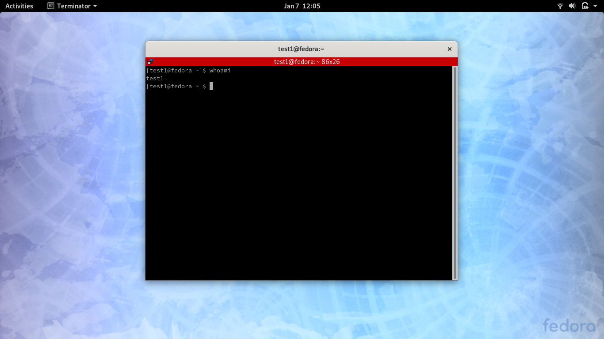

# ANSIBLE ROLE ADD USER #
Ansible Role to add or remove user accounts.

## Configuring the Playbook ##
You can change the name of the users or the default passwords by changing the [roles/adduser/tasks/main.yml](roles/adduser/tasks/main.yml#L11)

Change this line with the names you want:
```
   - test1
   - test2
```

To change the password, you can create a hashed password using:

```
mkpasswd --method=sha-512
```

It will ask you for a password and return a hash. You need to replace the hash in the [roles/adduser/tasks/main.yml](roles/adduser/tasks/main.yml#L8)

```
    password: '$6$/f4/cQ5LfMMH6Bmr$8VYq36Meq9bvke05ObxY8XVreT3QJPILEE5RrVdoeW5TMTZ3YcnIX4gOQhgOYdqnA8TYyYnJoFWsKuCyJjmY90'
```

By default, I've set the password to `m1m3`

For more configuration options, you can visit offical documentation [here](https://docs.ansible.com/ansible/latest/modules/user_module.html)

## Usage ##

To add the users:

```
ansible-playbook add.yml -K
```

To remove the added users:

```
ansible-playbook remove.yml -K
```

## Tutorial ##

[](https://asciinema.org/a/XdKVQXyCuRXmAmY5SRC80jtjJ)

## Proof ##


