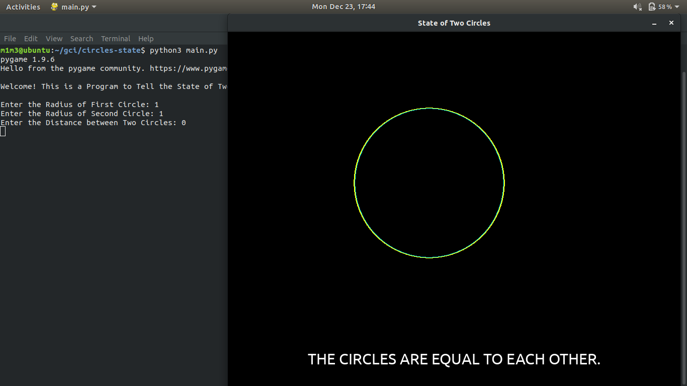
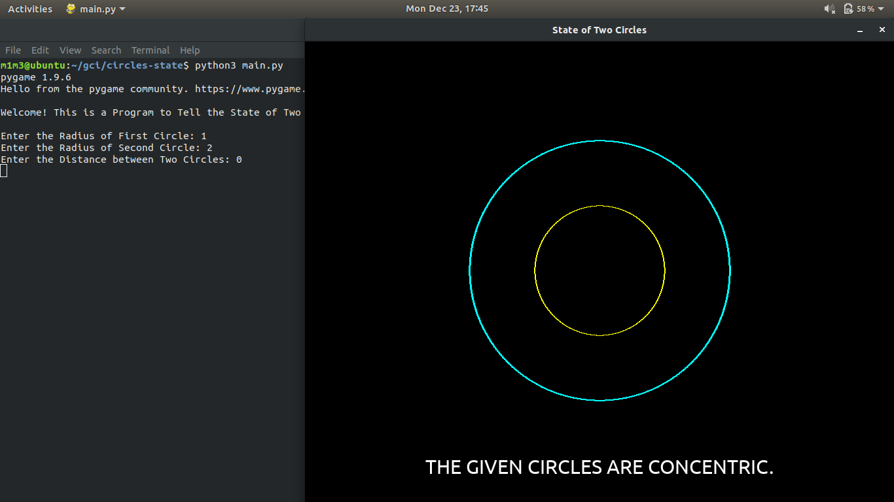
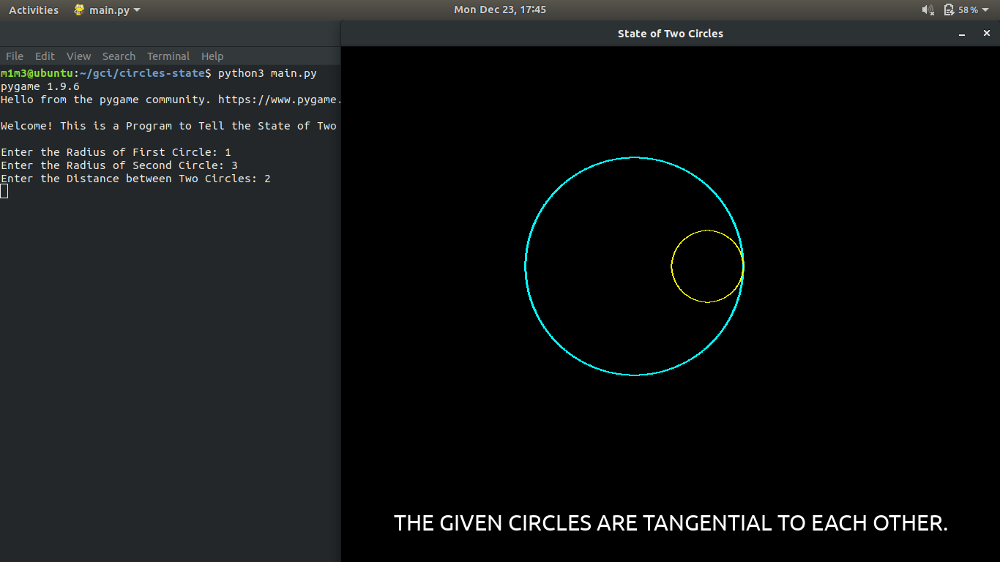
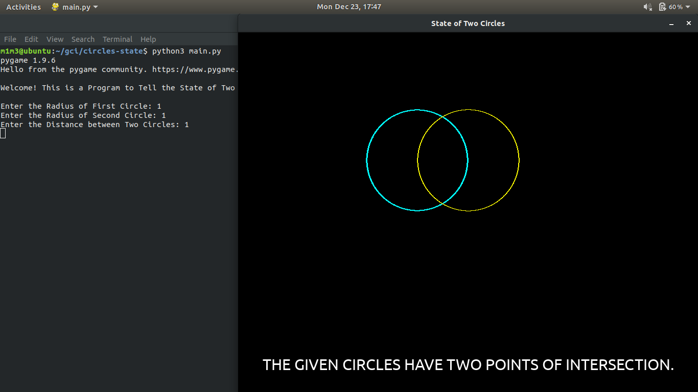
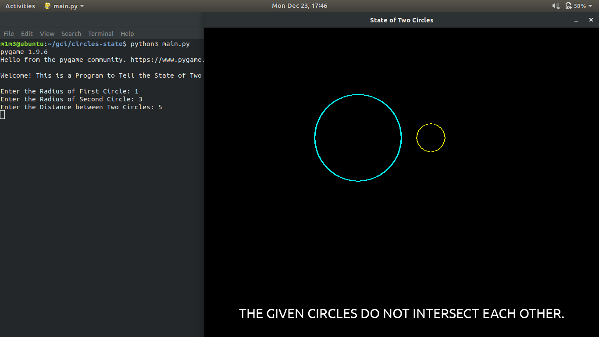

# STATE OF TWO CIRCLES #

This is a python based script that tells the state of given two circles and represents them.

## Introduction ##

A circle is the locus of a point which moves in a plane such that its distance from a fixed point always remains constant. The fixed point is called centre of the circle and the distance from the centre to a point on the circle is called the radius of the circle.

Two Circles can basically have four different states:

1. They can be Equal.
2. They can be Tangential.
3. They can be Concentric.
4. They can be Intersecting or Non Intersecting.

This is a program which takes the radius of two circles and the distance between them as input and diplays their state.

## Usage ##

```
$ python3 main.py
```
```
Welcome! This is a Program to Tell the State of Two Circles.

Enter the Radius of First Circle: 
Enter the Radius of Second Circle: 
Enter the Distance between Two Circles: 
```
Enter the required information to get the result.

## Examples ## 

### 1. Equal Circles: ###




### 2. Concentric Circles: ###




### 3. Tangential Circles: ###




### 4. Intersecting Circles: ###




### 5. Non-Intersecting Circles: ###

