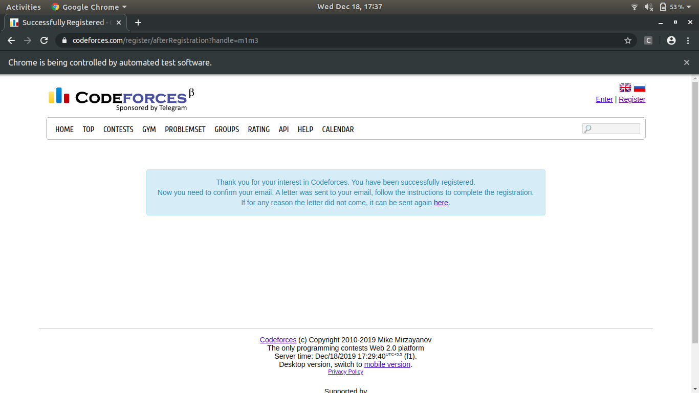

# Codeforces AutoRegistration #
A python script that automates the task of registration on CodeForces Website.

# Introduction #
Codeforces is a project joining people interested in and taking part in programming contests. On one hand, Codeforces is a social network dedicated to programming and programming contests. On the other hand, it is a platform where contests are held regularly, the participant's skills are reflected by their rating and the former contests can be used to prepare. Codeforces constantly develops and we plan to improve the platform to give the participants the opportunity to organize their own contests, filling the project with learning content, developing Codeforces as a training and learning platform. 
# Requirements #
```
$ pip3 install selenium
$ pip3 install webdriver
```

# Usage #
```
Usage: autoreg.py [options]

Options:
  -h, --help        show this help message and exit
  -H, --handle      Specify a unique handle.
  -e, --email       Specify a valid mail
  -p, --passwd      Specify a password. Minimum 8 characters long.

```                        
NOTE - You can also enter these details inside the script

```
$ python3 autoreg.py
Enter the Handle: 
Enter the Email: 
Enter a Password (Minimum 8 Character Long): 
```
# Proof #

