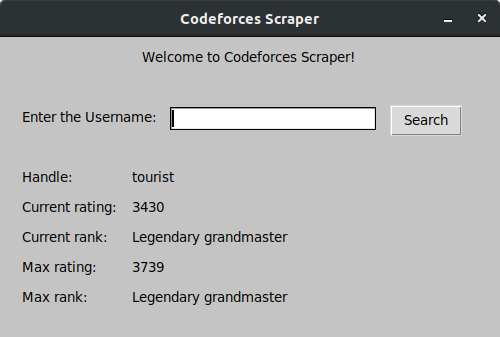

# CODEFORCES SCRAPER #

A python script to scrape information from Codeforces Website

## Introduction ##


Codeforces is a project joining people interested in and taking part in programming contests. On one hand, Codeforces is a social network dedicated to programming and programming contests. On the other hand, it is a platform where contests are held regularly, the participant's skills are reflected by their rating and the former contests can be used to prepare. Codeforces constantly develops and we plan to improve the platform to give the participants the opportunity to organize their own contests, filling the project with learning content, developing Codeforces as a training and learning platform.

## Requirements ##
```
$ pip3 install -r requirements.txt
```

## Usage ##

```
$ python3 main.py
```
```
Welcome to the CodeForces Scraper!

1. GUI
2. CLI

Enter your Choice: 
```
Or you can specify the mode as an argument

For CLI Mode:
```
$ python3 main.py --cli
```
```
Enter your username: tourist

Handle:  tourist
Current Rating: 3430
Current Rank: Legendary grandmaster
Max Rating: 3739
Max Rank: Legendary grandmaster
```
For GUI Mode:

```
$ python3 main.py --gui
```


