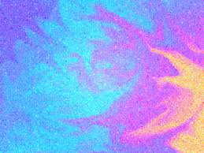
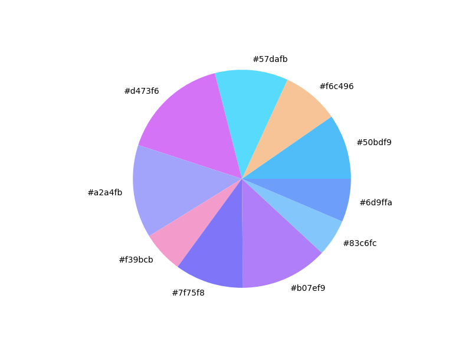

# COLOR DETECTION #

A python program to detect colors in an image.

## Introduction ##

### OpenCV ###

OpenCV (Open Source Computer Vision Library) is an open source computer vision and machine learning software library. OpenCV was built to provide a common infrastructure for computer vision applications and to accelerate the use of machine perception in the commercial products. The library has more than 2500 optimized algorithms, which includes a comprehensive set of both classic and state-of-the-art computer vision and machine learning algorithms. These algorithms can be used to detect and recognize faces, identify objects, classify human actions in videos, track camera movements, track moving objects, extract 3D models of objects, produce 3D point clouds from stereo cameras, stitch images together to produce a high resolution image of an entire scene, find similar images from an image database, remove red eyes from images taken using flash, follow eye movements, recognize scenery and establish markers to overlay it with augmented reality, etc.

## Requirements ##
```
$ pip3 install -r requirements.txt
```

## Usage ##
```
$ python3 main.py
```

## Tutorial ##

### I'll be using this image for this tutorial: ###



### You can choose to plot a PIE Chart: ###



[](https://asciinema.org/a/1vJ89UMW83cbjEA8syprYJDJ6)
