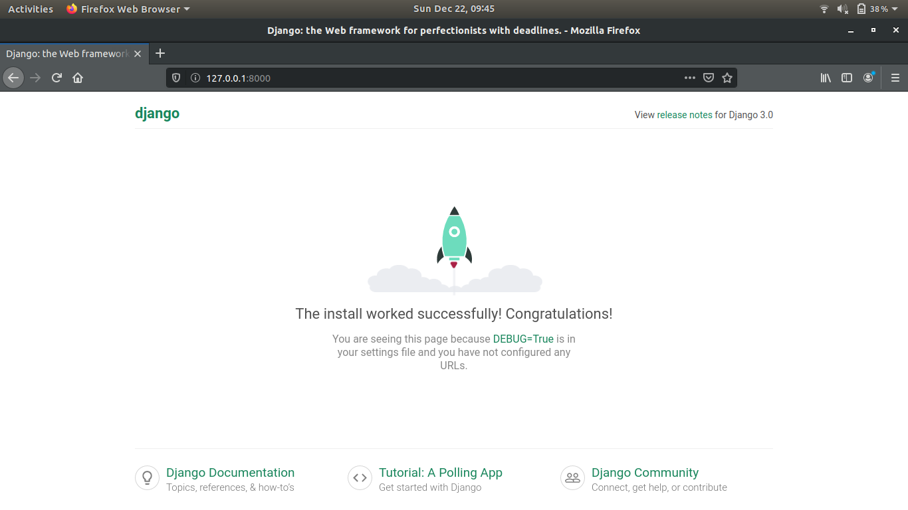
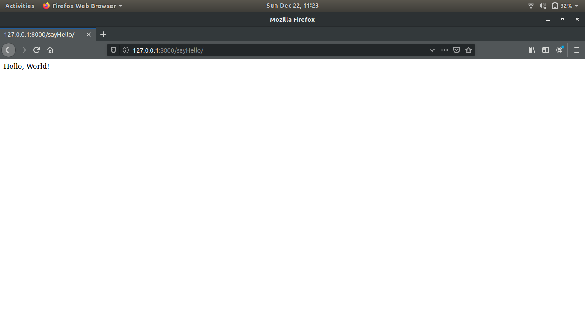

# Django Hello-World #

A tutorial on how to install Django framework in Linux and running a Hello-World program.

## Introduction ##

Django is a high-level Python Web framework that encourages rapid development and clean, pragmatic design. Built by experienced developers, it takes care of much of the hassle of Web development, so you can focus on writing your app without needing to reinvent the wheel. It's free and open source.

## Installation ##

 To install Django in your Linux machine, Run the following commands in your terminal.

```
$ sudo apt install python3 python3-pip python3-venv
```

Create a Directory for Project:

```
$ mkdir demo-project
```

Then create a virtual environment inside the directory

```
$ cd demo-project

$ python3 -m venv env

$ source env/bin/activate

$ pip install django

```

## Creating a Demo Application ##

The django-admin command provides you option to create a new Django application via command line. First, navigate to the directory you need to create a new application.

Then use django-admin startproject command followed by the application name to create new Django application

```
$ django-admin startproject demo
```

## Creating a SuperUser For Administration: ##

We can create a superuser account for the administration of the Django application. Run the following command from your Django application directory.

```
$ cd demo
$ python3 manage.py createsuperuser 
```

## Testing The Application ##

Finally, run the Django application server with below command. Here 0.0.0.0:8000 defined that Django will listen on all interfaces on port 8000. You can change this port with any of your choices.

```
$ python3 manage.py runserver 0.0.0.0:8000
```

Django application server is running now. Open your favorite web browser and access to localhost on port 8000. This will show you the default Django web page.



## Running the Hello-World Application ##

First clone this repository using the following command:

```
$ git clone https://github.com/MR-M1M3/django-helloworld.git
```

Switch to the `django-helloworld` directory

```
$ cd django-helloworld/helloworld
```

Run the python server:

```
$ python3 manage.py runserver
```
Django application server is running now. Open your favorite web browser and access to `127.0.0.1:8000/sayHello` This will show you the Hello-World Django web page.



