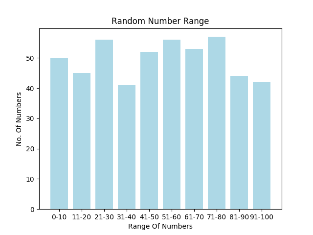

# Introduction To Makefile #

A basic Makefile which will execute a small C++ program which would output some data to a text file. A python program will then read the data from this file and plot it.

## What is a Makefile? ##
If you want to run or update a task when certain files are updated, the make utility can come in handy. The make utility requires a file, Makefile (or makefile), which defines set of tasks to be executed. You may have used make to compile a program from source code. Most open source projects use make to compile a final executable binary, which can then be installed using `make install`.
In this program, I've created Makefile using a basic example. 

## Requirements ##

You don't need any specific module for using or running a makefile. But for this program you'll need to install `matplotlib` for plotting a graph. 

```
$ pip3 install -r requirements.txt
```

## Usage ##

To simple run the program, use:

```
$ make
```

This will generate some files and will display the graph.

Optionally, you can use a call single module.

To generate the random data, use:

```
$ make generate
```

To plot the generated data, use:

```
$ make plot
```

To clean the generated files, use:

```
$ make clean
```

## Understanding the Concept ##

```

CC = g++
CFLAGS = -Wall -g
CPPTARGET = createData

py = python3
target = plot

all: generate plot

generate: $(CPPTARGET).cpp
	$(CC) $(CFLAGS) -o $(CPPTARGET) $(CPPTARGET).cpp
	chmod +x $(CPPTARGET)
	./$(CPPTARGET)
	@echo Welcome to the Introduction to Makefile!
	@echo
	@echo This file will generate some random data and plot it on a graph.
	@echo
	@echo Data Generation Successfull!
	@echo

plot: $(target).py
	@echo Plotting the Graph....
	@echo
	$(py) $(target).py

clean:
	rm -rf $(CPPTARGET) data.txt
  ```
  
- The first few lines are simply declaration of variables.
- The `all:` is a function that will call other targets i.e. `generate` and `plot`
- To use a variable, we use `$(variable_name)`
- To print any statement, we use `@echo`
- The `generate` target will compile `createData.cpp` and generate some random data
- The `plot` target will call python and run `plot.py`
- The `clean` target will clear the generated files

## Result ##

After Running `make` You'll see a Graph Something Like This


