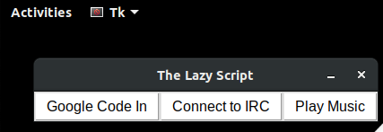
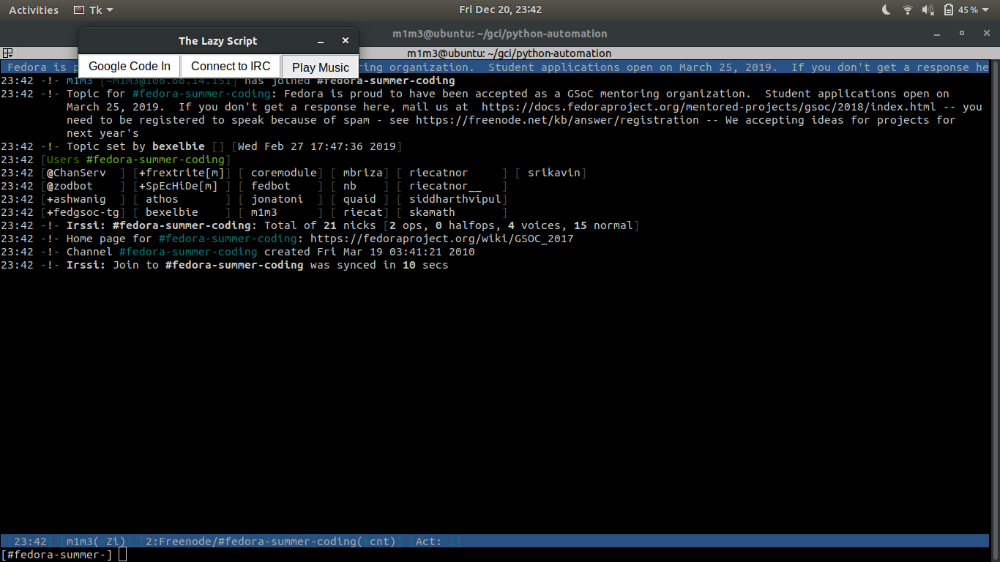
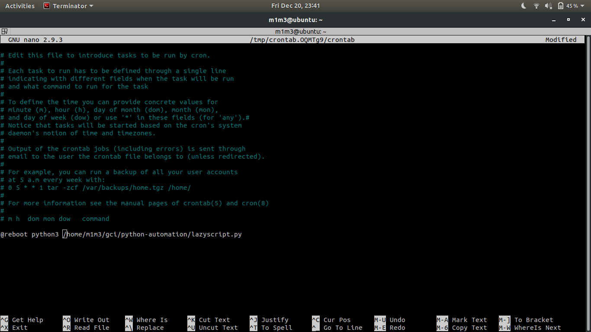

# The Lazy Script #
A python based GUI made for some automation.

# Introduction #
#### According to [Wikipedia](https://en.m.wikipedia.org/wiki/Automation): ####
Automation is the technology by which a process or procedure is performed with minimal human assistance. Automation or automatic control is the use of various control systems for operating equipment such as machinery, processes in factories, boilers and heat treating ovens, switching on telephone networks, steering and stabilization of ships, aircraft and other applications and vehicles with minimal or reduced human intervention.
This is a basic script which can do three simple tasks.

# Requirements #
```
$ sudo apt-get install python3-pil.imagetk
```
# Usage: #
```
$ python3 lazyscript.py
```
It displays a nice GUI



You Can Choose three options:
1. Open GCI Website
2. Open IRC client ``` irssi ```
3. Playing your Favorite Music

Here's an example of opening IRC



### Running This Scirt Automatically on Startup
For Ubuntu, you can directly go to the startup application app and add your program there.
Here I'll explain adding it through command line.
Open your terminal and type:
```
$ crontab -e
```
It was then ask you for an editor. Choose you favorite editor
```
no crontab for username - using an empty one

Select an editor.  To change later, run 'select-editor'.
  1. /bin/nano        <---- easiest
  2. /usr/bin/vim.basic
  3. /usr/bin/vim.tiny
  4. /bin/ed

Choose 1-4 [1]: 1
```
I chose nano. Then it will open the config file. At the end of the file, add a line:
```
@reboot python3 /path/to/directory
```


You are done with it. Save and exit the file. Now the program will start automatically on bootup.

