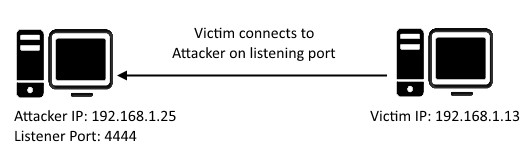
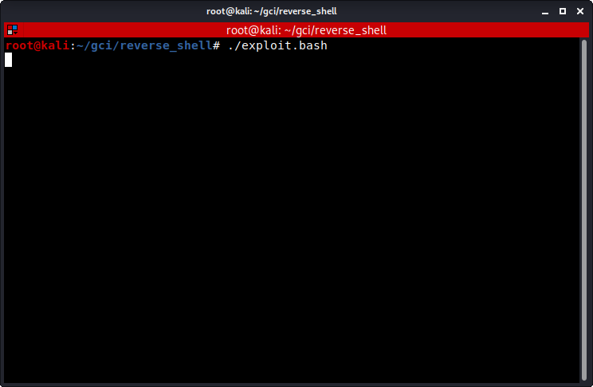

# Reverse Shell #
A demonstration to get reverse shell in Linux.
NOTE - This is only for education purposes.

## Introduction ##

A reverse shell is a type of shell in which the target machine communicates back to the attacking machine. The attacking machine has a listener port on which it receives the connection, which by using, code or command execution is achieved.

## How to use the Program? ##

For gaining a reverse shell, you need to run `attacker.py` in your host machine and `exploit.sh` in the target machine. Both the scripts should run simultaneously. 

NOTE - First run the `attacker.py` and then `exploit.bash`

## Tutorial ##

### Victim Machine ###

### Host Machine ###

## How to prevent such type of attacks? ##

There are a number of ways that people attempt to mitigate these attacks.

- External

   1. Prevent spam filter from allowing MIME types frequently associated with malware (it's highly unlikely there is a business relevant reason to send .exe or .bat files for instance)
   2. Use Anti-Virus as .exe's can be detected even after several rounds of encoding. Preferably you'd want "behavioural based" anti-virus which block applications based on actions they attempt to take.
   3. Educate your staff on how to spot threats and what to do should they encounter them.
   4. If you're IT department is big enough and you want to pull your hair out figuring it out, software restriction policies can be implemented to only allow known .exe's from running
   5. Disable the ability for executables to run from the temp directory / directories
   6. Implement firewall egress filtering. Set up a proxy with deep packet inspection that intercepts SSL / TLS connections and blocks outbound traffic that seems suspicious.

- Internal

   1. Do not give local admin access to end users. Just don't. If they need to raise privileges assign them a special account that they have to use the "Run As..." functionality to use, but end users should not have administrative privileges on their workstations.
   2.  Software restrictions / egress filtering / AV / Education / disabling executables from temp directory all still apply for internal
   3. Segregate your network to prevent lateral movement in the instance there is compromise

