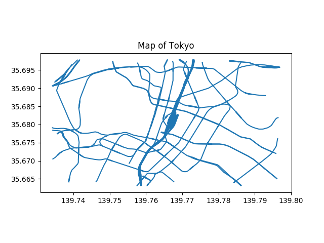

# Shapefiles and Maps #

A python script to plot shapefiles for five different cities

## Introduction ##

The shapefile format is a geospatial vector data format for geographic information system (GIS) software. It is developed and regulated by Esri as a mostly open specification for data interoperability among Esri and other GIS software products. The shapefile format can spatially describe vector features: points, lines, and polygons, representing, for example, water wells, rivers, and lakes. Each item usually has attributes that describe it, such as name or temperature.

## Requirements ##

```
pip3 install geopandas
pip3 install matplotlib
pip3 install descartes
```

## Usage ##

```
$ python3 main.py
```
Choose the City for which you want to plot the map.

```
Welcome to the Shapefiles and Maps!

Choose a city for which you want to plot the map: 

1. Delhi
2. Mumbai
3. Chandigarh
4. Tokyo
5. London

Enter your Choice: 
```

Choose the data you want to plot. You can enter multiple values here.

```
What would you like to plot

1. Buildings
2. LandUse
3. Natural
4. Places
5. Railways
6. Roads
7. Waterways

Enter your Choice (Separated by Comma):
```

## Examples ##

1. Map for Roads in Delhi:


2. Map for Railways in Tokyo:



3. Map for Buildings and Waterways in Mumbai:


