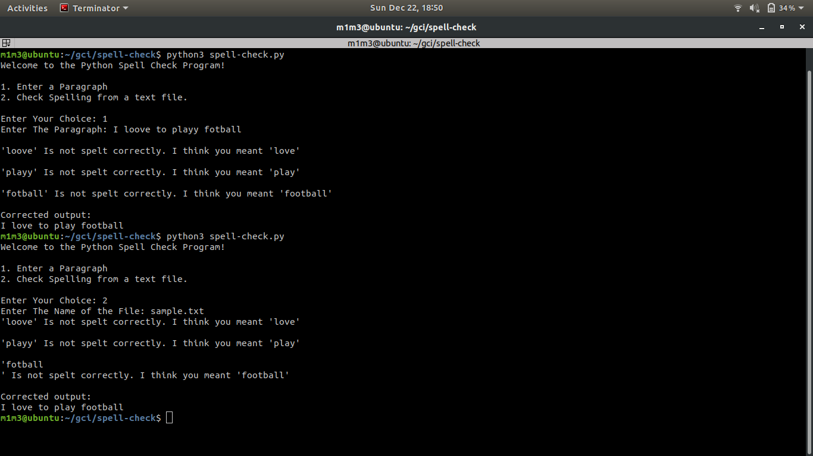

# PYTHON SPELL CHECK PROGRAM #

A python based script to check spellings in a given paragraph and display the correct output.

# Requirements #

```
$ pip3 install pyspellchecker
```
# Usage #

```
$ python3 spell-check.py
```

To Check the spellings from a given paragraph, choose 1.

```
Welcome to the Python Spell Check Program!

1. Enter a Paragraph
2. Check Spelling from a text file.

Enter Your Choice: 1
Enter The Paragraph:
```

To Check the spellings from a text file, choose 2.

```
Welcome to the Python Spell Check Program!

1. Enter a Paragraph
2. Check Spelling from a text file.

Enter Your Choice: 2
Enter The Name of the File: sample.txt
```

# Example #

