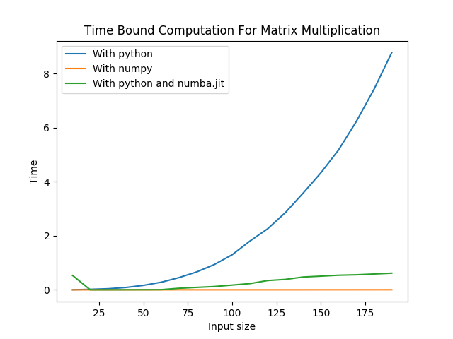

# TIME BOUND COMPUTATION  #

A python script that does time bound computations for multiplication of matrices using three different methods.

## Requirements ##

```
$ pip3 install numpy
$ pip3 install numba 
$ pip3 install matplotlib
```
## Usage ##
```
$ python3 main.py
```

## Output Graph ##


## Numba JIT ##
Numba is an open-source JIT compiler that translates a subset of Python and NumPy into fast machine code using LLVM, via the llvmlite Python package. It offers a range of options for parallelising Python code for CPUs and GPUs, often with only minor code changes. 

## Python Numpy ##
Numpy is a general-purpose array-processing package. It provides a high-performance multidimensional array object, and tools for working with these arrays. It is the fundamental package for scientific computing with Python. 

## Numpy vs Normal Python ##

Followings are the main reasons behind the fast speed of Numpy.

- Numpy array is a collection of similar data-types which are densely packed in memory. A Python list can have different data-types, which puts lots of extra constraints while doing computation on it.
- Numpy is able to divide a task into multiple subtasks and process them parallelly.
- Numpy functions are implemented in C. Which again makes it faster compared to Python Lists.

## Numba JIT vs Normal Python ##

Numba is a library that enables just-in-time (JIT) compiling of Python code. It uses the LLVM tool chain to do this. Briefly, what LLVM does takes an intermediate representation of your code and compile that down to highly optimized machine code, as the code is running. Therefore it is much faster than the pure python code and even competes with the numpy multiplication.
