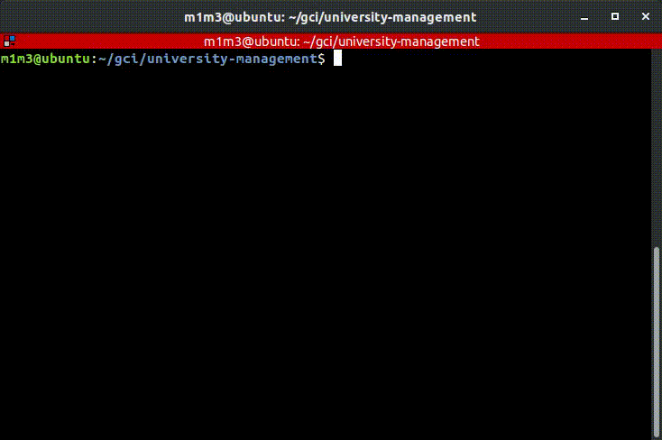

# UNIVERSITY DATA MANAGEMENT #
An algorithm that manages given data and selects the best applicants among them.

## Requirements ##
```
$ pip3 install -r requirements.txt
```

## Usage ##
```
$ python3 main.py
```

## Tutorial ##

