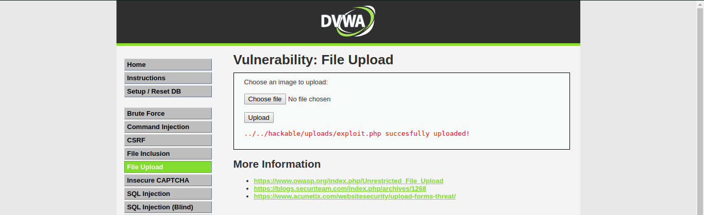
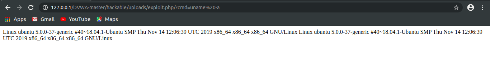

# Unrestriced File Upload Vulnerability #

## Introduction ##

File upload vulnerability are a major problem with web based applications. Uploaded files represent a significant risk to applications. The first step in many attacks is to get some code to the system to be attacked. Then the attack only needs to find a way to get the code executed. Using a file upload helps the attacker accomplish the first step. In many web server this vulnerability depend entirely on purpose that allows an attacker to upload a file hiding malicious code inside that can then be executed on the server.

## Types of File Upload Vulnerability ##

There are two basic kinds of file upload vulnerabilities. We are going to give these descriptive names in this article that you may not have heard elsewhere, but we feel these describe the difference between the basic types of upload vulnerability.

A local file upload vulnerability is a vulnerability where an application allows a user to upload a malicious file directly which is then executed.

A remote file upload vulnerability is a vulnerability where an application uses user input to fetch a remote file from a site on the Internet and store it locally. This file is then executed by an attacker.

## Exploiting the Vulnerability ##

For this example, I will be  using [DVWA](https://github.com/ethicalhack3r/DVWA) which is used by beginner pentesters to learn website penetration testing. I have set the difficulty level to low. The low difficulty level does not checks for the file extension or size. For exploiting the vulnerability, we need to create php exploit code that would help to execute basic linux commands.

### Exploit Code: ###

```
php
<?php
echo system($_GET["cmd"])
?>
```
We can make more advanced PHP exploits using `weevely` which gives you more functionality.

### Uploading the exploit ###

Head over to DVWA and choose the File Upload Tab. Upload your exploit to the website.



### Accessing the Exploit ###

Goto to the upload path in the url box and enter the command you want to run. For example, I'll be showing the information about the machine add `?cmd=uname -a` in the URL. You'll see the following result.



Therefore, we managed to gain access over the machine. We can even bypass more advanced checks. For example, If the browser checks for the file extension or the image header, it can be easily bypassed using the [BurpSuite.](https://portswigger.net/burp) If the browser checks for the image size, it can be bypassed using [gifsicle](https://github.com/kohler/gifsicle)

## What are the File Upload Risks? ##

There are three risks when allowing file uploads on your site:

1. Overwriting an existing file – If a file is uploaded with the same name and extension as an existing file on the server, this could overwrite the existing file. If the file that was overwritten is a critical file, the new file can potentially be used to launch a server-side attack. This could cause the website to no longer function, or it could change security settings to allow attackers to upload further malicious files.

2. Malicious content – If the uploaded file contains an exploit, malware, malicious script or macro, the file could be used to gain control of the server or infect users’ machines.

3. Very large file upload – If an extremely large file is uploaded, this could cause a Denial of Service (DDos) attack and bring down the site.

## Methods to avoid remote file upload vulnerabilities ##

Avoiding this kind of vulnerability is similar to avoiding a local file upload vulnerability:

- File type verification

    File types are usually defined by their file extensions. Each file type usually has several corresponding file extensions. The file extensions enable the operating system and users to easily identify the type of file.

    Attackers can bypass security systems and spoof operating systems and users by changing file extensions. For example, hackers can rename a malicious .exe file into a legitimate-looking .docx file. To prevent this, you must verify the file type before allowing upload.

- Restrict specific file extensions

    A whitelist provides system access only to administrator-approved programs, IPs and email addresses. Creating a white list of allowed files enables you to avoid uploads of potentially malicious content to your site. The white list can include executables, scripts and any other file type.

- Malware prevention

    Websites that insert or parse data from uploaded files may be vulnerable to malware attacks. To prevent malware, you should scan all uploaded files with multiple anti-malware tools. Each tool uses different algorithms and specializes in different categories.

- Remove embedded threats

    Anti-malware tools don’t always detect embedded threats in PDFs, MS Office and image files. For example, attackers use digital watermarking techniques to embed malicious code inside an image or video file. Make sure to remove any possible embedded objects from your uploaded files.

- User authentication

    User authentication methods validate the identity of the person requesting private information. Implement robust user authentication protocols like Two-factor authentication (2FA).

    Two-factor authentication is a two-step authentication process. The process combines a password and username with a physical or mobile token for extra security. The sequence of authentication factors makes it more difficult for a potential intruder to gain access.

- Store files in an external directory

    Upload files to external directories and store them outside the webroot. This technique prevents attackers from executing malicious files through a website URL.

- Simple error messages

    Error messages sometimes use server configuration settings or directory paths to give more information to the user. However, cybercriminals can use the information from error messages to exploit vulnerabilities in uploaded files. For this reason, you should make the error message as simple as possible.

- Only allow specific file extensions.
- Only allow authorized and authenticated users to use the feature.
- Check any file fetched from the Web for content. Make sure it is actually an image or whatever file type you expect.
- Serve fetched files from your application rather than directly via the web server.
- Write to the file when you store it to include a header that makes it non-executable.
- Limit the file size to a maximum value in order to prevent denial of service attacks (on file space or other web application’s functions such as the image resizer).
- Restrict small size files as they can lead to denial of service attacks. So, the minimum size of files should be considered.

    
## Additional Resources ##

For more information about File Upload Vulnerability, you can visit [here.](https://www.owasp.org/index.php/Unrestricted_File_Upload)
