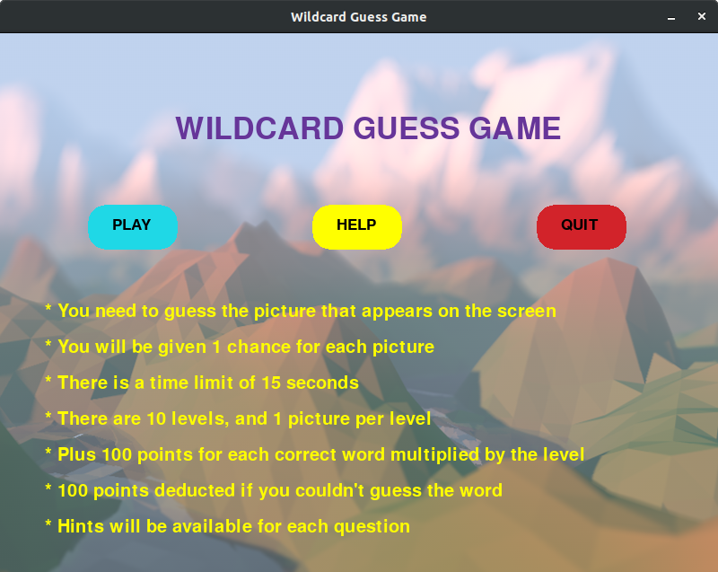

# Wildcard Guess Game #

A Wildcard Guess Game in Python. The game consists of 10 section, each section provides a card with a given picture and the user must guess name of the card in the given time.

## Requirements ##

```
$ pip3 install -r requirements.txt
```

## Sample Images ##




